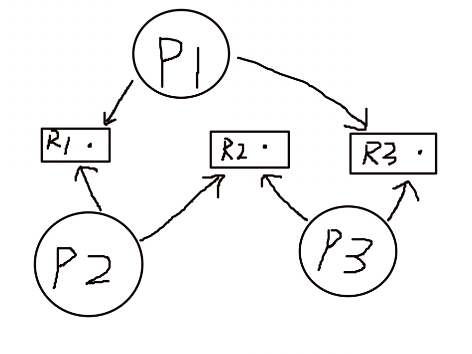
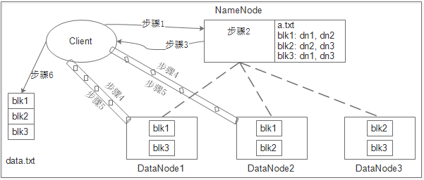
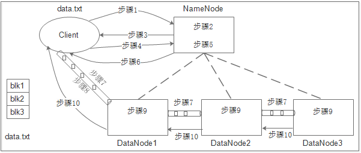
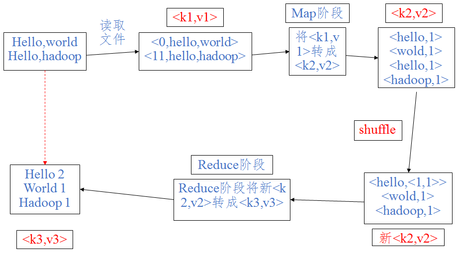
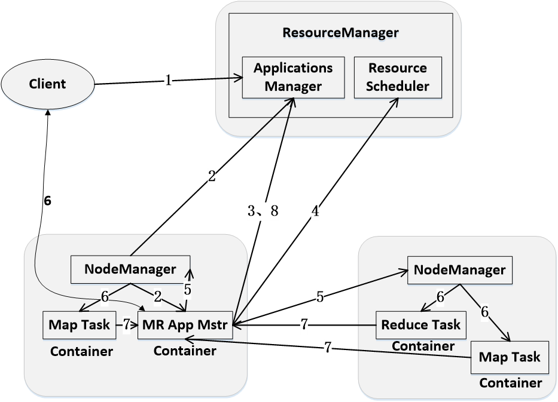

# review
## 计算机组成原理
### 补码运算
* 什么是补码
    >正数的补码是本身，负数的补码符号位不变，其他取反，末位加一。补码运算的结果还是补码所以注意还原。
    ```python
    '假设机器字长为8位'
    20+(-25)=-5
    #20=00010100（原码）=>00010100（补码）
    #-25=10011001（原码）=>11100110（反码）=>11100111（补码）
    #00010100+11100111=11111011（这就是结果的补码）
    ```
* 运算溢出
    >假设机器字长为8位则符号位为左到右第一位，次高位为左到右第二位。定义两个变量p,q 如果最高位有进位则p=1否则p=0,次高位如果有进位则q=1否则q=0。p异或q的结果如果为1则有溢出否则无溢出，若有溢出且q==1则为正溢出否则一定是p==1是为负溢出。<br/>
    异或：假设`*`为异或符号 `0*0=1,1*1=1,0*1=0,1*0=0`

### 微处理器及其结构
* 微处理器的工作流程
    1. CS+IP计算得到内容地址读取指令
    2. 指令放入指令缓冲器
    3. EU控制电路根据当前类型执行不同操作
    4. ALU收到相关操作数执行相关操作
    5. 运算结果标志放到FR
    6. 运算内容放到内存
    7. 目标地址与DS做运算的到存储地址
    8. 存放结果到指定地址
* intel 8086微处理器寄存器结构
    1. 通用寄存器
        >四个16位寄存器AX,BX,CX,DX也可以分为两个8位寄存器使用，高8位寄存器AH,BH,CH,DH,低8位寄存器AL,BL,CL,DL，这些寄存器可以保存目标操作数或是计算的结果，在有些命令中这些寄存器有特殊的用途比如AX作为累加器、BX作为基址寄存器、CX作为计数寄存器、DX作为数据寄存器。
    2. 指针及变址寄存器
        >两个指针寄存器SP、BP和两个变址寄存器SI、DI。通常用来存放存储器单元的16位偏移地址。其中SP为栈顶偏移地址，BP用来存放堆栈段中一个数据区的基址的偏移量。SI和DI存放数据所在存储单元的偏移量。
    3. 段寄存器
        >有四个16位的段寄存器CS(code segment)、DS(data segment)、SS(stack segment)、ES(extra segment)。
    4. 指令指针
        >指令指针IP为16位寄存器指向BIU下一条要取的指令代码的16位偏移地址。
    5. 标志寄存器
        >16位状态标志寄存器FR。<br/>
        CF：进位标志，表示本次加减法最高位产生进位或者借位的情况，CF=1表示有，CF=0表示没有。<br/>
        PF：奇偶校验标志，本次运算结果低8位中1的个数，PF=1表示有偶数个1，PF=0表示有奇数个1。<br/>
        AF：辅助进位标志加减法中D3向D4进位或借位的情况，AF=1表示有，AF=0表示没有。<br/>
        ZF：零标志，ZF=1表示运算结果为零，ZF=0表示运算结果不为零。<br/>
        SF：表示运算结果的正负情况，SF=1表示运算结果为负，SF=0表示运算结果为正。<br/>
        OF：溢出标志，OF=1表示正在进行的补码运算有溢出，OF=0表示无溢出。<br/>
        以上为状态标志位，下面为控制标志位。<br/>
        DF：方向标志，DF=1串操作过程中地址自动减1，DF=0自动加1.<br/>
        IF：中断允许标志，IF=1开中断，IF=0关中断。<br/>
        TF：单步标志，TF=1 CPU处于单步工作方式每执行完一条指令产生一次内部中断，TF=0 CPU不以单步方式工作。
    
* intel 80486
    * 工作模式
        1. 实地址模式
            >最基本的工作模式，兼容8086并且增强寄存器扩充指令可进行32位操作
        2. 保护模式
            >和实地址模式的不同在于存储器地址空间扩大（由1MB到4GB）以及存储器管理机制不同。
        3. 虚拟8086模式
            >既可以运行80486也可以运行8086提供保护模式下的全部功能具有更大灵活性。
    * 总线操作
        1. 总线
            >内部总线：CPU与其他芯片之间的连线<br/>
            系统总线：各集成电路板之间的连线<br/>
            外部总线：微机系统与其他设备之间的连线
        2. 总线操作
            >总线请求和仲裁、寻址阶段、数据传送阶段、结束阶段
        3. 各种周期
            >时钟周期：CPU执行指令的最小时间单位，与微机主频有关<br/>
            总线周期：CPU对存储器或者I/O端口完成一次读写操作的时间<br/>
            指令周期：CPU执行一条指令所需的时间由若干总线周期组成


### **指令系统** 

基本概念：<br/>
指令：一串二进制数指示计算机执行某种操作。<br/>
指令系统：CPU能识别的全部指令。<br/>
程序：一定顺序排列的指令的集合。<br/>
二进制数：12b,12B<br/>
十进制数：12,12D,12d<br/>
十六进制数：12H,12h,0AH,0BH,0A1H,1AH（以A~F开头要在前面加0<br/>
字节：8位<br/>
字：16位
* 对操作数的寻址方式
    >格式：`MOV 目标操作数,源操作数`<br/>
    将`源操作数`传送到`目标操作数`
    1. 立即数寻址
        >MOV AL,0FH #将8位立即数0FH传送到AL寄存器中<br/>
        MOV AX,0102H #将16位立即数0102H送到AX寄存器中
    2. 寄存器寻址
        >MOV AX,CX #将CX中的内容送到AX中
    3. 直接寻址
        >MOV AX,[2000H] #将EA=2000H字单元中的内容传送到AX寄存器中<br/>
        在汇编语言中带方括号的操作数为存储器操作数括号内的数为有效地址EA，假设DS=3000H EA=2000H则`物理地址=3000H*16+2000H=32000H`，由于AX目标操作数AX为字类型(16位)，所以`32000H`物理单元中的数值放到`AL`，`32001H`中的数值放到`AH`。<br/>
        MOV AX,[DATA] #还可以用变量代替数值<br/>
        MOV AX,DATA #还可以写成这样
    4. 寄存器间接寻址
        >寄存器的使用16位寻址和32位寻址时不一样
        1. 16位寻址
            >MOV AX,BX #物理地址=(DS)*16+(BX)<br/>
            MOV AX,BP #物理地址=(SS)*16+(BP)<br/>
            如果指令中指定寄存器为SI,DI,BX这3个，则操作数在数据段中，段基址在DS中。<br/>
            若指定寄存器是BP，则操作数在堆栈中，段基址在SS中。
        2. 32位寻址
            >略
    5. 基址寻址
        >16位寻址：EA=(BX或BP)+位移量(8或16位) #注意默认的段寄存器<br/>
        32位寻址：EA=(基址寄存器)+位移量(8或32位) #8个32位通用寄存器均可作为基址寄存器
    6. 间址寻址
        >和基址寻址类似，这里各种寻址就是使用的寄存器不同叫法不同而已计算过程都是一样的。后面的寻址方式就省略了。
* 对程序转移地址的寻址方式
    ```
    段内直接寻址
    JMP SHORT LOOP1 #短程转移
    JMP NEAR PTR LOOP2 #进程转移
    段内间接寻址
    JMP BX
    JMP WORD PTR[SI+2000H]
    段间直接寻址
    JMP FAR PTR LOOP3
    段间间接寻址
    JMP DWORD PTR[BX]
    ```
* 常见指令
    ```
    AND d,s
    OR d,s
    XOR d,s
    NOT d
    SAL d,count #算数左移，末位补0，最高位移入CF
    SAR d,count #最高位移入次高位的同时值不变！末位移入CF
    SHL d,count #逻辑左移，同SAL
    SHR d,count #最高位补0，末位移入CF
    ROL d,count
    ROR d,count
    RCL d,count
    RCR d,count
    LOOP 目标符号 #CX=CX-1，CX!=0，也就是先使CX寄存器的内容自动减1
    #再判断CX的内容是否为0，不为0才可能跳转到目标符号处进行下一轮循环
    ADD d,s #(d)<-(d)+(s)
    INC d #(d)<-(d)+1
    SUB d,s ##(d)<-(d)-(s)
    DEC d #(d)<-(d)-1
    NEG d #按位取反后加1
    MUL s #如果s为字节：AX<-AL*(s),如果s为字则DX,AX<-AX*(s)
    DIV s #字节操作时，16位被除数在AX中，8位除数为源操作数，结果的8位商放在AL中，8位余数放在AH中，
    #AL<-AX/(s)，AH<-AX/(s)；
    #字操作时,32位被除数在DX，AX中（DX为高位字），16位除数为源头操作数，结果16位商放在AX，16位余数放在DX，
    #AX<-DX,AX/(s),DX<-DX,AX/(s)
    ```
### **汇编语言程序设计**
* 表达式
    * 数值表达式
        >10H,(6*A-B)/2,-5
    * 地址表达式
        >[BX+SI+5000H],AX
* 表达式中常用运算符
    ```
    SEG N1=N1所在段的段基址
    OFFSET N1=N1的偏移地址
    ```
* 变量定义伪指令
    ```
    STRING DW 'C','DDG'
    VAR DB 2,10H
    VAR DD 100H
    T1 DB 4 DUP(6H,3 DUP(78H))
    ```
* 符号定义伪指令
    ```
    COUNT EQU 5
    COUNT1 = 5
    都表示左边符号等于5，但是EQU不能重新定义，=可以重新定义更加灵活。
    ```
* 例题
    ```
    ORG 0200H
    ARY DW -1,-2,-3,-4
    CNT DW $-ARY
    VAR DW ARY,$+4
        ...
    MOV AX,ARY
    MOV BX,OFFSET VAR
    MOV CX,CNT
    MOV DX,VAR+2
    LEA SI,ARY
        ...

    求程序执行后
    AX=(FFFFH),BX=(020AH),CX=(0008H),DX=(0210H),SI(0200H)
    ```
### 存储系统
* 存储系统的层次结构
    ```
    cpu寄存器        快
    cpu内部cache     
    主板cache
    主存储器
    辅助存储器
    大容量辅助存储器   慢
    ```
* 主存储器的分类
    >按照存取方式分可以分为只读存储器(ROM)和随机存取存储器(RAM)
    * ROM及其分类
        ```
        掩膜RMO：采用光刻图形技术一次性直接写入，一旦制成不能改写。
        PROM：可编程ROM，熔丝的断开与接通表示存储信息，由于熔丝烧断不能恢复所以只能写入一次不能擦出改写。
        EPROM：可擦除可编程ROM，用紫外线照射即可擦除内容。
        EEPROM：电可擦除可编程ROM既可以像RAM那样随机进行改写，又可以像ROM那样在断电的情况下保存数据，在指定引脚加上合适电压即可擦除和改写。
        Flash Memory：闪速存储器，和EEPROM类似也是一种电可擦写ROM，和EEPROM的区别是，EEPROM是按字节擦写的，速度慢；而闪存按块擦写。
        ```
    * RAM及其分类
        ```
        SRAM：静态随机存储器，集成度低，功耗大，成本高，用作小容量高速缓冲存储器。
        DRAM：动态随机存储器，集成度高，功耗低，价格便宜，由于电容漏电现象所以需要定时充电（刷新），常用作内存条。
        NVRAM：非易失性随机存储器，由SRAM和EEPROM组成，正常运行时和SRAM功能相同，掉电时将SRAM中的信息存储到EEPROM中，常用作掉电保护和保存存储系统中的重要信息。
        ```
* 存储器的扩展设计
    1. 位扩展
        >用两片1K\*4b 组成1K\*8b
    2. 字扩展
    3. 字和位扩展
* 虚拟存储技术
    >解决了用小容量内存运行大容量软件的问题。虚拟存储器就是虚拟存储管理系统。<br/>
    80486虚拟存储器空间最大可达2^46B,虚拟地址通过分段机制转化为线性地址再通过分页机制转化为物理地址。

### 中断技术
* 中断源的分类
    ```
    外部中断：外部设备通过硬件请求的方式产生的中断，又称硬件中断。
    外部中断又有不可屏蔽中断（NMI）和可屏蔽中断（INTR）。
    内部中断：CPU运行程序错误或执行内部程序调用引起的中断，也称为软件中断。分为异常和INT n指令中断两类。
    ```
* 中断的处理过程
    ```
    请求中断
    中断响应
    关闭中断
    保护断点
    中断源识别
    保护现场
    开放中断（给中断嵌套用的，如果没有嵌套则忽略）
    中断服务
    恢复现场
    中断返回
    ```
* 异常
    ```
    故障：在引起异常的指令之前发生，异常处理完毕后继续这条指令。
    陷阱：。。。
    异常终止：硬件错误或非法的系统调用必须重新启动系统。
    ```
* 中断向量表
    ```
    实地址模式下的叫法。
    存储着中断类型号对应的中断向量。
    位于内存底端第0段的1KB RAM区。
    ```
* 中断描述符表
    ```
    保护模式下的叫法。
    用于存放中断描述符。
    每个中断描述符占用8个字节，表共占用2KB，可以在内存的任意位置。
    ```
## 操作系统
### 第一章
* 在计算机系统操作系统是核心系统软件。
* 操作系统最重要的两个目标是有效性、方便性。
* 并发性是指若干事件在同一个时间间隔内发生。
* 进程切换不可能在用户态发生。
* 中断处理一定会保存而自程序调用不需要保存的是程序状态字寄存器。
* 时间片轮转对提高操作系统实时性无效。
* 是系统更加高效并不是微内核的优势。
* 学会画时序图以及计算CPU利用率。
### 第二章
* 程序是指令的集合，进程有状态而程序没有。
* 处理器状态信息有着处理器中各种寄存器的内容。
> 
* 由调度程序为进程分配CPU并不是创建进程所必须的。
* 同一个进程中的各个线程拥有各自不同的地址空间。
### 第三章
* 进程P创建的若干线程可以共享进程P的代码段、进程P打开的文件、进程P的全局变量不能共享进程P中某线程的栈指针。
* 进程中用于更改共享数据的那段程序就是临界区。
* 一个线程不能创建一个或多个进程。
```
生产者-消费者问题
var mutex=1;
var empty=1;
var full=0;
ParBegin:
Producer:
    while(1){
        P(empty)
        P(mutex)
        生产过程
        V(mutex)
        V(full)
    }
Consumer:
    while(1){
        P(full)
        P(mutex)
        消费过程
        V(mutex)
        V(empty)
    }
```
### 第四章
* 满足短任务优先且不会产生饥饿现象的是高响应比优先算法。
* 降低进程优先级的合理时机是进程的时间片用完。
* 可设计成抢占式的是时间片轮转调度算法。
* 进程处于临界区时也可以进行处理机调度。
* 优先级进程调度算法会引起进程的饥饿问题。
* 先来先服务、最短作业优先算法计算平均周转时间和平均带权周转时间。
周转时间就是进程在创建到完成执行的总时间，带权周转时间就是周转时间除以运行时间。
* 高响应比优先，响应比=1+等待时间/运行时间，比如进程P在8:00创建，需要一个小时的运行时间在10:00开始运行，则响应比为3.
### 第五章
* 产生死锁的根本原因是系统资源不足。
* 资源按序分配可以破坏环路等待资源的条件。
* 死锁的四个必要条件是循环等待资源、互斥使用资源、占有且等待资源、非抢占分配资源。其中互斥使用资源是无法破坏的。
* 死锁的避免事根据防止系统进入不安全状态采取措施实现的。
* 为进程一次性分配所需的资源是一种死锁预防。
* 系统处于安全状态时系统一定没有死锁，系统处于不安全状态时系统可能会出现死锁。
* 系统中有4个并发进程，都需要同类资源5个，该系统不会发生死锁的最小资源数是17.
* 银行家算法，写Need矩阵，安全序列，处理请求。
* 资源分配图
> 
### 第六章
* 某一作业完成后系统回收其主存空间，并与相邻空间合并，为此需要修改空闲分区表，造成空闲区数减一的情况是上下均有相邻空闲区。
* 分段式存储管理不会产生内部碎片,分页式没有外部碎片。
* 可变分区分配，首次适应，最佳适应，最差适应。
* 分页存储管理方式提供一维地址结构。
* 采用段页式存储管理时，一个程序如何分段是在用户编程时决定的。
* 系统发生抖动时应该撤销部分进程。
* 分页或者分段提供给用户的物理地址空间不能确定谁大谁小。
* 块表在计算机系统中用于地址变换。
* 某个分页存储管理系统中，用户空间共有32个页面，每页1KB，主存16KB。
问逻辑地址有效位是多少？物理地址有效位是多少？用户进程只有4页，0，1，2，3页分别对应的物理块号为5，10，4，7，将虚地址0A5C，053C，103C转换为物理地址。
    ```
    页大小为1KB=2^10
    0A5C=0000 10|10 0101 1100
    右边十位是内容，左边的就是页号，这里是2，所以对应的块号为4则物理地址为0001 0010 0101 1100=125C
    ```
* 对于下面的段表，将逻辑地址转换为物理地址。
    ```
    [0,137][1,4000][2,3600][5,230]
    [段号，内存地址，段长]，
    [0,   50KB,   10KB],
    [1,   60KB,   3KB],
    [2,   70KB,   5KB],
    [3,   120KB,  8KB],
    [4,   150KB,  4KB]

    [0,137]=50KB+137
    [1,4000] 4000>3KB ,越界中断
    ```
### 第七章
* 页面置换算法FIFO置换（先来先服务）、LRU置换（最近最久未使用）。
* 抖动现象，刚被淘汰的页面有马上被使用。
* Belady现象分配的物理块越多，缺页次数反而越多。FIFO会出现Belady现象，而LRU不会。
* 段号>段表长度，段内地址<段长，都是越界中断。段不在内存中缺段中断。
* 存储管理方案中，单一连续区存储管理可采用覆盖技术。
* 虚拟存储器的最大容量取决于计算机的地址结构。
* 考虑下面的页访问串
    ```
    1,2,3,4,2,1,5,6,2,1,2,3,7,6,3,2,1,2,3,6
    分配4个物理块初始都为空
    1.LRU
    1 2 3 4 2 1 5 6 2 1 2 3 7 6 3 2 1 2 3 6
    1 2 3 4 2 1 5 6 2 1 2 3 7 6 3 2 1 2 3 6                   
      1 2 3 4 2 1 5 6 2 1 2 3 7 6 3 2 1 2 3                 
        1 2 3 4 2 1 5 6 6 1 2 3 7 6 3 3 1 2                
          1 1 3 4 2 1 5 5 6 1 2 2 7 6 6 6 1 
    + + + +     + +       + + +     +      
    2.FIFO
    ...
    3.optimal
    1 2 3 4 2 1 5 6 2 1 2 3 7 6 3 2 1 2 3 6
    1 2 3 4     5 6         7      1              
      1 2 3     3 3         6      6            
        1 2     2 2         3      3            
          1     1 1         2      2           
    + + + +     + +         +      +                                  
    ```
### 第八章
* 字符设备不可寻址，即不能指定输入的源地址和输出的目标地址。
* 磁盘是可共享的设备，每一时刻至多能有一个作业启动它。
* 首先获得键盘输入的程序是中断程序。
* I/O控制方式主要掌握DMA和通道方式。
* DMA方式是直接在主存和I/O设备之间建立一条直接数据通路，不需要CPU干预。
* CPU和设备控制器之间增设通道，通道是专用的I/O处理机，实现外部设备和内存的直接通信，而且通道部件执行自己的指令控制I/O设备。
* 程序员使用系统调用打开I/O设备时通常使用的设备标识名是物理设备名。
* 采用SPOOLing技术将一台物理I/O设备虚拟为多台逻辑对应物。
* 缓冲解决设备输入输出和程序处理速度不匹配的问题。单缓冲，双缓冲，循环缓冲，缓冲池。
* 如果I/O所花费时间比CPU处理时间短得多则缓冲区几乎无效。
* 从属关系不是设备分配所需要考虑的问题，设备安全性、设备无关性、设备的固有属性都是需要考虑的。
* 虚拟设备指的是把一个物理设备转化为多个逻辑设备。
* SPOOLing技术就是空间换时间的技术。
* 磁盘的移动臂调度是为了缩短寻道时间。
* 缓冲池通常在主存中。
* 采用单缓冲，外设读入一个数据块到系统缓冲区为100，系统缓冲区到用户工作区为5，分析一个数据块的时间为90，完成两个数据块的时间最少为300。
* 磁盘寻道算法FCFS（先来先服务）、SSTF（最短寻道时间优先）、SCAN（电梯调度）、C-SCAN（单向循环扫描）
* 有4个记录存放在磁盘的某个磁道上，将磁道划分为4块，磁盘旋转速度20ms一周，每读出一个记录后要5ms处理，处理完4个记录的时间要85ms，优化分布后要45ms。
### 第九章
* 逻辑记录是对文件进行存取操作的基本单位。
* 文件的物理结构有顺序结构（顺序存取速度快，不利于动态扩充会产生碎片）、链接结构（查找效率低，指针消耗额外外存，动态扩充方便解决外存碎片问题）、索引结构（易于实现文件增删，索引表增加存储空间开销对文件系统效率影响较大）。
* 空闲盘块的分配：检查专用块是否上锁，如果上锁则等待；否则查看空闲块块数，大于1则空闲块块数减1，并从专用块顶部取出空闲盘块号分配给用户；若专用块块数等于1且不是最后一组，将此盘块内容读入专用块，作为专用块新内容，并把栈中原来的盘块分配出去。
* 空闲盘块回收：检查专用块是否上锁，上锁则等待；否则如果当前组空闲盘块数不足100块，便将回收的盘块号记入专用块顶部，空闲盘块数加1，空闲盘块数已达100时，便将现有专用块中的内容记入新回收的盘块中，然后将新回收的盘块号写入专用块作为新的一组空闲块的第一个盘块号，此时空闲块数为1.
* 文件按逻辑分可以分为无结构文件（流式文件）和有结构文件（记录式文件）。
* 文件索引中有7个地址项，其中4个为直接地址索引，2个地址项是一级间接地址索引，1个地址项是二级间接地址索引，每个地址项大小为4字节，若磁盘索引块和磁盘数据块均为256字节则可表示的最大文件长度是（1057KB）。
* 文件控制块（FCB）在顺序结构时应指出用户第一个逻辑记录的物理地址以及整个文件的长度；链接结构应指出用户首尾逻辑记录的物理地址；索引结构应包含索引表；多级索引应包含最高级的索引表。
* 文件系统采用两级索引的方式，每个磁盘块大小为1KB，磁盘块占4B，系统中单个文件的最大长度为（32MB）。
* 已知位示图，给出（i,j）位置对应的柱面号，磁头号，扇区号。
## 云计算
### 云计算概述
* 云计算的特点有动态扩展、资源虚拟、按需付费、分布式。
* Google云计算基础架构包括MapReduce、BigTable、GFS。
* 云计算的主要服务有SaaS（软件即服务，比如Google Apps,Salesforce CRM）、PaaS（平台即服务,Google App Engine,Microsoft Azure,主要面向程序开发人员一般不需要配置环境）、IaaS（硬件即服务,Amazon EC2,Eucalyptus，需要配置环境主要面向架构师）、CaaS（通讯即服务）。
### 分布式文件系统
* HDFS是雅虎对Google GFS的开源实现。其中客户端（Client）没有管理命名空间的功能。
* 诸如 UNIX 平台的传统文件系统通常包含，超级块、文件内容、Inode、目录内容。
* 分布式文件系统的典型架构，其中重要的服务器包括如下部分，主控服务器、数据服务器、客户端。
* NameNode 心跳机制是用于监测 DataNode 工作状态。
* 分布式文件系统是指文件系统管理的物理存储资源不一定直接连接在本地节点上，而是通过计算机网络与节点相连。
* HDFS 读取 data.txt 文件过程



    ```
    1.发送读取文件的请求。
    2.检测权限，判断文件是否存在，如果可以读取则利用特定策略等选择block。
    3.返回主机列表{block0:datanode0,block1:datanode1...}
    4.client与返回的datanode建立pipeline
    5.下载对应block，以packet为单位并行下载。
    6.合并block为一个完整的文件。
    ```
* HDFS 写入 data.txt 文件过程

    

    ```
    1.Client向Namenode发送上传文件的请求。
    2.检测权限。
    3.返回可以上传的答复。
    4.对数据分块，向集群请求上传Block。
    5.根据集群中的Block信息和机架感知原则，选出可以上传的datanode。
    6.返回datanode。
    7.与这些datanode建立pipeline。
    8.以packet为单位上传数据。
    9.缓存数据。
    10.返回ack应答信息。
    ```
* 进程、线程、并发、并行、分布式计算
    ```
    进程是资源分配的基本单位

    线程是程序执行流的最小单元，是系统独立调度和分配cpu资源的最小单元。

    并发是多线程的调度是一种伪并行

    并行是在同一时刻调用多种独立资源，必须具有多个处理器核心

    分布式计算首先这个计算任务是要可以分成多个子任务的，然后将这些子任务分配给不同计算机进行并行计算
    ```
* 
### MapReduce编程实例



* 继承Mapper重写map方法。
    ```
    public class WordCountMapper extends Mapper<LongWritable,Text,Text,LongWritable>{

        @Override 

        protected void map(LongWritable key,Text value,Context context){

            String[] s=key.trim().toString().split(',');

            for(String i : s){

                context.write(new Text(i),new LongWritable(1));

            }

        }

    }   
    ```
* 继承Reducer重写reduce方法。
    ```
    public class WordCountReducer extends Reducer<Text,LongWritable,Text,LongWritable>{

        @Override 

        protected void reduce(Text key,Iterable<LongWritable> values,Context context){

            long c=0;

            for(LongWritable i : values){

                char+=i.get();

            }

            context.write(key,new LongWritable(c));

        }

    }
    ```
* 编写main主类继承Configured类以及实现Tool接口，重写run方法，写函数入口main。
    ```
    public class JobMain extends Configured Implements Tool{

        public int run(String[] args){

            Job job=Job.getInstance(super.getConf,"wordCount");

            job.setJarByClass(JobMain.Class);

            job.setInputFormatClass(TextInputFormat.Class);

            TextInputFormat.addInputPath(job,new Path("hdfs://..."));

            job.setMapperClass(WordCountMapper.Class);

            job.setMapperOutputKeyClass(Text.Class);

            job.setMapperOutpurValueClass(LongWritable.Class);

            job.setReducerClass(WordCountReducer.Class);

            job.setOutputKeyClass(Text.Class);

            job.setOutputValueClass(LongWritable.Class);

            job.setOutputFormatClass(TextOutputFormat.Class);

            TextOutputFormat.addOutputPath(job,new Path("hdfs://..."));

            boolean b=job.waitForComplete(True);

            return b?0:1;

        }

        public static void main(String[] args){

            int run=new ToolRunner.run(new Configuration,new JobMain,args);

            System.exit(run);

        }

    }
    ```
### NoSQL数据库
* NoSQL数据库缺乏统一的查询语言，而关系型数据库有标准化查询语言。
* NoSQL数据库的可扩展性比传统的关系型数据库更好。
* NoSQL数据库具有弱一致性，关系型数据库具有强一致性。
* NoSQL数据库有四大分类，键值存储数据库（查找速度快但是数据无结构，Oracle BDB）、列存储数据库(查找速度快可扩展性强，利于分布式实现，但是功能局限比如HBase)、文档型数据库（数据结构不严格但是查询效率不高缺乏统一的查询语言比如MongoDB）、图形数据库（灵活多变但是不太好做分布式集群方案Neo4J）
* NoSQL三大理论基石是最终一致性、BASE(最终一致性和软事物（软状态和基本可用）)、CAP(一致性，可用性，分区容忍性)。
* HBase的数据模型有行键，列族，时间戳，单元格（由来前面三者唯一确定），区域（分布式存储和负载均衡的最小单元，建议大小1~2GB）。
* HBase的三层结构的顺序是Zookeeper文件,-ROOT-表,.MEATA.表。
* 客户端通过三级定位寻址来定位Region。
* HBase Shell可以通过put:向表，行，列指定的单元格添加数据；list:列出所有数据库；create：创建表；get:通过表名，行，列，时间戳，时间范围和版本号来获得对应的单元格的值。
* HBase是针对谷歌BigTable的开源实现。
* 传统关系型数据库和HBase的区别在于，存储模式，可伸缩性，数据索引，数据维护。
    ```
    传统关系型数据库基于行模式存储，HBase基于列存储，不同列族文件分离。

    关系型数据库难以实现横向扩展，纵向扩展空间也有限。而HBase和BigTable这些水平扩展很灵活能够轻易在集群中增加硬件来实现来实现性能的伸缩。

    通过行键扫描访问，整个系统因为这个索引不会慢下来。

    在关系型数据库中，更新操作会用最新的值替换当前值，旧的值不会被保存。而HBase则会保留旧版本的信息。
    ```
* 访问HBase表中的某一行，可以通过单个行键访问、全表扫描、行键区间。
* 列式存储的优势，空间无浪费、可伸缩性。概念视图向物理视图的转换。
### 虚拟化
* 虚拟机的优势有封装性，隔离性，兼容性但是不独立于硬件。
* 虚拟化技术已经成为私有云，混合云设计方案的基础，比如OpenStack,KVM,Docker。Storm不是虚拟化技术的方案。
* NFV(Network Function Virtualization）关注于网络控制面和转发面的分离，处理的是OSI模型中的4-7层。
* 虚拟化是云计算的技术支持。
* 虚拟化未来的四大发展趋势。
    ```
    连接协议标准化，解决终端和云平台之间的广泛兼容性。

    平台开放化，增强兼容性，支持异构的虚拟机系统和开放合作的产业链需求。

    公有云私有化，实现既享受公有云的便利又保证私有数据的安全性。

    虚拟化客户端硬件化，终端芯片将可能逐渐加强对于虚拟化的支持，对虚拟化指令有较好的硬件辅助支持。
    ```
### 数据中心
* 数据中心的选址主要考虑地址环境，气候条件，电力供给，网络带宽，水源条件，人力资源。
* 数据中心的发展主要经历了巨型机时代、微型机时代、互联网时代、云计算大数据四个阶段。
* 数据中心基础设施效率（DCIE）=IT设备能耗/数据中心设备总能耗×100％，PUE = 数据中心设备的总能耗/ IT设备的能耗，IT设备能效比 =IT设备每秒的数据处理流量/IT设备的能耗。
* 简述云计算大数据时代的数据中心发展的 5 大趋势。规模化，虚拟化，绿色化，集中化，低成本。

### HDFS
* 第二名称节点不是第一名称节点的热备份，而是辅助处理数据的。
* HDFS HA提供高可用性，解决了单点故障问题。
* 第二名称节点无法解决单点故障问题。
* Hadoop1.0存在的问题有，开发者自己管理作业间的依赖问题、执行迭代作业效率低、表达能力有限、抽象层次低。
* 新一代资源管理调度框架YARN实现一个集群多个框架即一个集群的统一资源调度管理框架，MapReduce2.0运行在YARN之上的计算框架，YARN为它提供了资源调度服务。YARN体系包括三个组件，ResourceManager,NodeManager,ApplicationMaster。
* Tez支持DAG作业的计算框架，Kafka分布式发布订阅消息。Pig处理大规模数据的脚本语言。Oozie工作流和协作服务引擎。
### YARN工作流程


    ```
    1.提交任务
    2.要求启动MR App Mstr。
    3.返回资源需求列表。
    4.返回资源分配列表。
    5.分配任务。
    6.任务分发给具体Container。
    7.返回计算结果和计算状态。
    8.回报结果，注销。
    ```


